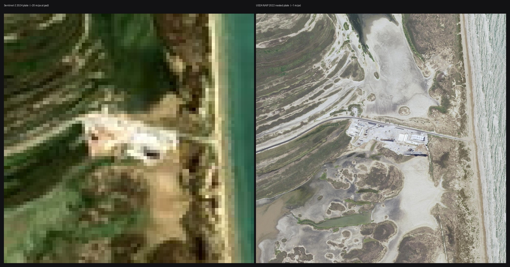
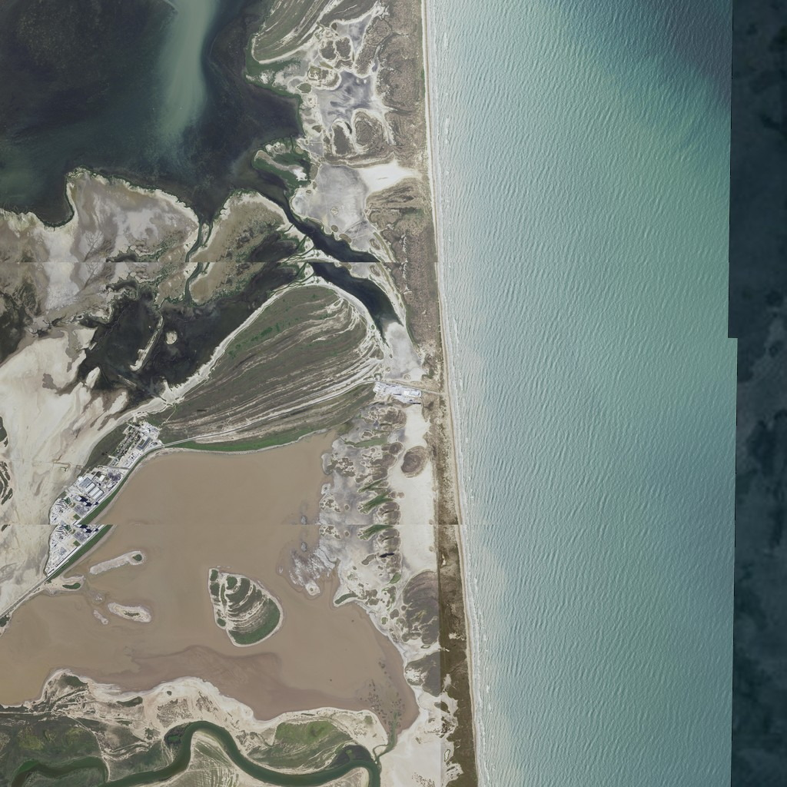

# Visual realism backlog

Living plan for **visual** improvements that raise credibility and watchability
while staying **theater-grade** (not flight-ops imagery or ops-grade CFD).

Scene unit remains **1 km**. Prefer small, focused diffs. FX must stay
**scrub-deterministic** (driven by mission time / state, not wall-clock only).

Related:

- [NEXT.md](./NEXT.md) — overall product roadmap (watchability, physics, architecture)
- [PLAN.md](../PLAN.md) — physics fidelity track
- [STARSHIP_13.md](./STARSHIP_13.md) — Flight 13 recap + webcast still SOP + highlight-clip sources (photorealism look target)
- [STARSHIP.md](./STARSHIP.md) — Super Heavy / ship / Raptor / Starbase pads (public hardware vs theater)
- [AGENTS.md](../AGENTS.md) — agent commit/hygiene rules

**Live:** https://julerex.github.io/tothemoon/

**Status (2026-09-28):** V0–V29 are **shipped** (including **V29** crest foam
on the existing swell and chop). **V30–V47 are queued** — crown and mist,
the wet shield, then Starship, Super Heavy, and Mechazilla. Flight 13 highlight clips in
[STARSHIP_13.md](./STARSHIP_13.md) and the webcast stills remain the look
reference. Implement one slice at a time.

---

## Current baseline (what we already have)

| Area | In place |
|------|----------|
| **Bodies** | NASA Blue Marble albedo (procedural fallback) + atmo limb + LRO WAC Moon (procedural fallback); true radii |
| **Sky** | NASA SVS star map, ecliptic-aligned dome |
| **Lighting** | Ephemeris directional sun (`sunLight.ts`); Flight 13 daytime pad fill; ground-sky shell for low altitude |
| **Pad** | Surveyed 15-vertex site apron (OLP-2 through farm to OLP-1) + circular OLM lip, hex truncated-pyramid OLM (V24), N–S matte white tank farm on per-bank slabs + dark north pipe rack, denser open Mechazilla (V25), **OLP-1** compact yard + crawler crane ~363 m east / ~69 m south with stripped mount (V26), **V27** 2-bay box-section lattice + dusk work lights + 3D chopsticks (catch rail / walkway) + wrap-around ship QD, trench, deluge/vent steam; Sentinel-2 surrounds plate + five landward 80 km neighbors + nested USDA NAIP pad plate (farm on NAIP is outdated) |
| **Craft** | Near-true Super Heavy + Ship, tiles, Raptors, multi-layer plumes plus axial exhaust stream (V25), V3 triangular hot-stage A-frame truss, condensation |
| **FX** | Staging fallaway/flash, boostback flash, entry plasma, multi-layer lunar dust, ocean splash, Gulf catch plate |
| **Cameras** | Trench, pad, chase (look-ahead/bank/finale bias), fin/gridfin, Auto-cam profiles (lunar + Flight 13) |
| **Overlays** | Trails (phase-reactive), orbit grids, Kepler corridor, cislunar beat whiskers, locators |

**Shipped (V0):** soft anti-sun fill, stronger Earth/Moon limb, night-led pad floods, Earthshine on Moon, procedural Earth night lights.

**Shipped (V1):** regime-specific multi-layer plumes (atmosphere denser/tighter, vacuum wider/sparser, LOI + landing ship looks), dual hot-stage lights, scrub-safe thrust lag + gimbal wobble.

**Shipped (V2):** Fresnel Rayleigh-ish multi-shell Earth limb, soft surface terminator, higher-contrast cloud deck, Moon mare/highland + crater-rim contrast for low sun, continuous lunar roughness.

**Shipped (V3):** pad close-up — scorch/water stains, multi-tier deluge + sheets, chopsticks/QD silhouette, trench heat haze.

**Shipped (V4):** stainless anisotropy + weld rings, windward heat-shield edge wear, denser high-contrast grid fins for fin/gridfin cams.

**Shipped (V5):** tight pad+craft sun shadows, mild bloom + altitude exposure, star-dome fade, entry brownout haze.

**Shipped (V11):** NASA Blue Marble Earth albedo + Sentinel-2 Starbase surrounds plate.

**Shipped (V6–V10, V12):** terminal dust/splash, Flight 13 entry craft, recovery catch, lunar Malapert plate, finale Auto-cam beats, coast watchability.

**Shipped (V14):** pink-magenta atmosphere / landing plumes, Super Heavy cryo frost + ice shed, denser ground-hugging pad steam with engine-warm core.

**Shipped (V13):** hexagonal TPS (grout + white experiment tiles; no missing-tile holes), **S40** stencil, stainless oil-canning + heat tint, residual grout glow, wide onboard fin/gridfin FOV.

**Shipped (V15):** magenta/violet entry plasma (belly + flap leading edges), violet tile fill; residual grout into descent stays warm.

**Shipped (V16):** Pez hatch + ~20 Starlink V3 silhouettes + payload ticker/scrub beats.

**Shipped (V17):** white splash steam + warm core, ocean glitter on splash/Gulf plates, wet hull roughness punch.

**Shipped (V18):** engine-bay MLI / plumbing / skirt ribs / bell stencil IDs; mild fisheye + grain on fin/gridfin only.

**Shipped (V19):** altitude-gated LEO cloud shell + ocean sun-glint; Earth-cam stays cloudless Blue Marble (#14).

**Shipped (V21):** splash-zone swell + water texture; puffy cumulus at ~2 km AGL that the ship falls through (local, not a globe deck).

**Shipped (V20):** LRO WAC color mosaic on the Moon (procedural canvas fallback).

**Shipped (V22):** Raptor 3 fluted bells + powerheads, stainless engine-bay puck /
gimbal rams, Super Heavy V3 90/90/180 grid fins with catch hardware, **B20** stencil.

**Shipped (V23):** pad T−5 aerial massing — matte white tank farm + berm, open
tubular Mechazilla truss, circular hardstand / thicker OLM, lattice chopsticks + QD hoses;
**V23.5** soft cryo vent sprite puffs (replacing faceted icosahedron lobes).

**Shipped (V25):** collimated pink–white **axial exhaust stream** (T+0 punch /
T+16 shaft vs billboard blobs) + denser Mechazilla (mid-face columns, all-face
X-braces, peak house/railings, open elevator cage, thicker T-chopsticks).

**Shipped (V26):** OLP-1 second tower ~363 m east / ~69 m south (empty mount,
Flight 13 is OLP-2); tower-base GSE house; Mach-diamond discs on the launch stream.

**Shipped (V27):** Mechazilla vs sunset OLIT still — box-section 2-bay cage,
warm work lights (floodBase), 3D chopstick truss with catch rail + walkway,
lattice ship QD with wrap-around clamp. Published dims / node names unchanged.

**Shipped (V28):** splash and Gulf seas share a sun-path glitter (ephemeris
sun, grazing-bright) and a feathered plate rim. The Gulf beacon, ring, and
label are off inside 30 km.

**Shipped (V29):** crest foam on the chop crests of the existing sea. The
gate is negative laplacian of the same five sines, not slope. Static albedo
flecks are gone. Seat height is unchanged.

**Queued (V30–V47):** crown/sheet, wet heat shield, wake, splash
light, then Starship, Super Heavy, and Mechazilla. Specs below.

Key modules: `src/scene/{bodies,craft,craftFrost,earthTheater,starbasePlate,earthAtmosphere,cinema,textures,sunLight,groundSky,stagingFx,entryFx,landingFx,splashFx,splashWeather,terminalFx,gulfLandFx,padRecoveryFx,padLaunchFx,plumeRegime,coastCorridor,engineBay,onboardPost,leoClouds}.ts`.

---

## Working agreements

- **Theater vs ops:** document approximations in README or short code comments when adding “realistic-looking” FX.
- **Procedural first:** prefer canvas / GPU-cheap materials over huge DEM/satellite assets unless an explicit asset pipeline is accepted. Committed theater-grade JPEGs (NASA Blue Marble globe, LRO WAC Moon, Sentinel-2 Starbase plate + landward neighbors + USDA NAIP pad inset, with procedural fallback) are the accepted exception — not a tile server or DEM.
- **Scrub-safe:** opacity/scale/position from mission `t`, phase, alt, burn flags — not `performance.now()` alone (wall-clock OK only for toast/UI animation).
- **Scale honesty:** scene unit = 1 km; craft/pad true-scale; do not inflate the stack for “cinematics.”
- **Performance:** pad/chase cameras are the hot path; avoid full-scene real-time shadows without a tight focus frustum.
- **Hygiene:** `npm run typecheck`, `npm run lint`, `npm test`; commit + push finished units (`AGENTS.md`).

---

## Priority guide

| Priority | Theme | Why now |
|----------|--------|---------|
| **V0** | Lighting + Earth night | Helps every Earth shot on both missions |
| **V1** | Engines / burns by regime | Matches LOI + landing physics story |
| **V2** | Body atmosphere / surface | Limb, terminator, Moon low-sun |
| **V3** | Pad close-up | Trench + pad cams are first-class now |
| **V4** | Craft materials | Fin/gridfin cams need readable metal/tile |
| **V5** | Cinema (shadows / post) | Biggest jump; do after V0–V3 or risk thrash |
| **V6** | Terminal FX (dust / splash) | **Done** — both finales denser than a single disc |
| **V7** | Entry / belly-flop craft | **Done** — tile glow, hinged flaps, banked plasma |
| **V8** | Recovery catch theater | **Done** — Gulf plate, catch flash, chopsticks close |
| **V9** | Lunar site plate | **Done** — local Malapert mesh, wash, Moon-near shadows |
| **V10** | Coast / LOI watchability | **Done** — trail dim/pulse, whiskers, LOI bloom |
| **V11** | Pad horizon depth | **Done** — Sentinel-2 plate + Blue Marble |
| **V12** | Finale camera beats | **Done** — Auto-cam splash + last-30s lunar widen |
| **V13** | Hull-cam materials | **Done** — hex TPS, S40, oil-canning, wide fin-cam FOV |
| **V14** | Ascent plume / frost / steam | **Done** — pink-magenta atmo plumes, Super Heavy frost, denser pad steam |
| **V15** | Entry plasma palette | **Done** — magenta/violet flap wrap + violet tile fill |
| **V16** | Payload Pez deploy | **Done** — hatch + sat silhouettes + ticker beats |
| **V17** | Splash / ocean steam | **Done** — white contact cloud + glitter + wet hull |
| **V18** | Engine-bay / onboard | **Done** — MLI, stencil IDs, mild fisheye on fin/gridfin |
| **V19** | LEO Earth from hull-cam | **Done** — gated cloud shell + ocean glitter (does not undo #14) |
| **V20** | Moon photo albedo | **Done** — LRO WAC JPEG, V11 analogue |
| **V21** | Splash sea + weather deck | **Done** — swell/texture + ~2 km cumulus the ship falls through |
| **V28** | Sun path on the splash sea | **Done** — ephemeris glitter; gulf shares the water; locator off inside 30 km |
| **V29** | Crest foam | **Done** — chop-crest dashes on the existing harmonics; seat height unchanged |
| **V30** | Crown, sheet, hanging mist | **Queued** — soft ship splash vs short hard gulf splash |
| **V31** | Waterline and wet heat shield | **Queued** — heel into the sea; hex below the line goes wet |
| **V32** | Wake and foam raft | **Queued** — short ship wake; gulf does not float intact |
| **V33** | Splash light | **Queued** — cumulus cookies on the water; steam hides the hull briefly |
| **V34** | Ship planform hardware | **Queued** — hinges, raceway, header rings at hull-cam |
| **V35** | TPS close-up | **Queued** — grout, char gradient, white imaging tiles |
| **V36** | Ship plumes per bell | **Queued** — six on ascent; 3→2→1 sea-level on landing |
| **V37** | Landing-flip readability | **Queued** — flap sweep, chill vent, engines-down silhouette |
| **V38** | Leeward stainless identity | **Queued** — stringers, welds, S40, residual heat tint |
| **V39** | Engines-down three bells | **Queued** — Max Q / boostback frame shows three bells |
| **V40** | Booster raceway | **Queued** — barrel is the subject; lattice stays in the corner |
| **V41** | Per-bell landing plumes | **Queued** — 10→8→5 cores, not one scaled blob |
| **V42** | Hot-stage see-through | **Queued** — open A-frame; plumes stay color-separated |
| **V43** | Frost sheets and skirt soot | **Queued** — pad frost sheds; gulf booster stays sooted |
| **V44** | Chopstick carriage and cables | **Queued** — rails, sheaves, catenary; Flight 13 stays parked |
| **V45** | Ship QD and mount BQDs | **Queued** — two Pad-2 disconnects + chill vent |
| **V46** | Tower close-up | **Queued** — mast, elevator car, stair, open gratings |
| **V47** | Launch cloud lights the tower | **Queued** — diverter, lip sheets, warm leg bounce at T+0 |

---

## V0 — Lighting and Earth night — **done 2026-08-11**

### V0.1 Phase-aware lighting / fill / limb — **done**

- Soft **anti-sun fill** (`applyFillLight`) so night sides keep a readable silhouette.
- Stronger **Earth limb** shells + subtle **Moon limb** edge.
- Pad: **floods night-led**, restrained daytime fill (`earthTheater` floodBase).
- Cheap **Earthshine** on the Moon (`applyEarthshine`, dim bluish directional).

**Files:** `sunLight.ts`, `createScene.ts`, `bodies.ts`, mission theaters, `earthTheater.ts`.

### V0.2 Earth night lights / city glints — **done**

Procedural equirectangular city lights as `emissiveMap` (`makeEarthNightLightsTexture`). Metro clusters + corridor scatter; day side washed by sun.

**Files:** `textures.ts`, `bodies.ts`.

---

## V1 — Plume and engine realism by phase — **done 2026-08-11**

Raise credibility of burns without claiming CFD. Soft multi-layer **sprites**
(not geometric cones — those washed out pad/ship cams).

| Regime | Look |
|--------|------|
| Atmosphere ascent | Tighter, denser plume; max-Q condensation already exists |
| Vacuum / coast relight | Wider, sparser, more translucent |
| Hot-stage | Dual plumes more distinct (booster orange + ship blue lights) |
| LOI / landing | Stronger LOI scale/light; tighter cooler landing ship look |

Also shipped:

- Brief **gimbal** wobble + scrub-safe **thrust lag** (`plumeThrustLag`)
- **LOI visual beat**: ship LOI regime + trail linewidth/opacity during `approach` burn
- Detached-booster boostback vs landing regimes in `StagingFx`

**Files:** `plumeRegime.ts` (+ tests), `craft.ts`, `stagingFx.ts`, `toTheMoon.ts`.

---

## V2 — Body atmosphere and surface — **done 2026-08-11**

### Earth — **done**

- Soft **Rayleigh-ish limb** + thicker blue band near horizon — multi-shell Fresnel (`earthAtmosphere.ts`), day-weighted sun dir each frame
- Softer day/night **terminator** — `smoothstep` N·L in `MeshStandardMaterial` via `applySoftTerminator`
- Cloud deck: higher core/edge contrast + opacity for LEO

### Moon — **done**

- Stronger **crater / highland / mare contrast** at low sun (deeper floors, rim + ejecta strokes, south-polar cues)
- Continuous **roughness** gradient (maria smoother → highlands rougher)
- Landing dust already present — pair later with craft shadow when V5 shadows land

**Files:** `earthAtmosphere.ts` (+ tests), `bodies.ts`, `textures.ts`.

---

## V3 — Starbase pad close-up — **done 2026-08-11**

Pad massing reads from altitude; trench + pad cams need density up close.

- ~~Scorch / water stains on OLM and apron~~ **done** (procedural scorch map, water decals, runoff trails, darkened OLM top)
- ~~Deluge sheets more volumetric (still scrub-driven)~~ **done** (3-tier steam ring + sheet curtains along trench)
- ~~Chopsticks / QD arm silhouette during prelaunch~~ **done** (thicker arms, carriage cheeks, QD bellows/face)
- ~~Heat haze over trench at ignition~~ **done** (additive shimmer sprites, peak early burn, scrub-safe)

**Files:** `earthTheater.ts` (`createStarbasePad`, `createPadSurroundings`, `createMechazillaTower`, `updateStarbaseLaunchFx`).

---

## V4 — Craft materials (fin / gridfin cams) — **done 2026-08-11**

- ~~Stainless **anisotropy / weld rings** more readable at fin cam~~ **done**
  (`MeshPhysicalMaterial` circumferential anisotropy + brush/weld maps; denser shiny torus weld rings with shadow companions)
- Ship silhouette pass: lathe tangent ogive (tip +Z), flush cylinder weld bands (no hovering tori on the nose), Block 2 trapezoid flaps at public span/chord.
- ~~Heat-shield edge wear only on windward side~~ **done**
  (edge-biased TPS texture + char gradients; windward trim/wear strips; flap tile wear)
- ~~Grid fins: clearer silhouette against sky for gridfin cam~~ **done**
  (dark outer frame, denser 6×6 lattice, thicker frame members)

**Files:** `craft.ts` (+ `craftMaterials.test.ts`, `craftGeometry.test.ts`).

---

## V5 — Cinema — **done 2026-08-11**

### Soft shadows — **done**

Directional sun shadows for **pad + craft only** (tight ortho frustum re-centered on craft each frame via `updateSunShadowFocus`). Off above ~80 km so AU-scale views stay cheap. Log-depth friendly (light sits sunward of focus, not AU-scale).

### Light post stack — **done**

`EffectComposer` + mild `UnrealBloomPass` (high threshold → engines/Sun/floods) + `OutputPass`. Exposure adapts pad → LEO → deep space (`cinemaExposure`).

### Atmospheric haze by altitude — **done**

`groundSky` brownout tint on entry; star-dome opacity fades near pad and under brownout; blue sky shell still altitude-gated.

---

## Suggested sequencing (concrete)

Shipped order (historical; all **done**, V0–V29). **V30–V47** are the next queue.

1. ~~**V0.1 + V0.2** — lighting fill/limb + Earth night lights~~ **done**  
2. ~~**V1** — plume atmosphere vs vacuum + LOI/landing variants~~ **done**  
3. ~~**V3** — pad close-up (trench cam payoff)~~ **done**  
4. ~~**V2** — terminator / Moon low-sun polish~~ **done**  
5. ~~**V4** — craft materials as needed for fin/gridfin~~ **done**  
6. ~~**V5** — shadows / post only when the above is stable~~ **done**  

**Shipped (post-V5):**

7. ~~**V6** — terminal dust + splash (both missions)~~ **done**  
8. ~~**V7** — Flight 13 entry / belly-flop craft readability~~ **done**  
9. ~~**V8** — chopsticks catch + Gulf site plate~~ **done**  
10. ~~**V9** — lunar Malapert site plate (after V6 dust)~~ **done**  
11. ~~**V12** — finale camera beats alongside V6/V7~~ **done**  
12. ~~**V10** — coast watchability when long scrub feels empty~~ **done**  
13. ~~**V11** — pad horizon / satellite surrounds plate~~ **done** (see below)

**Shipped (photorealism vs Flight 13 stills):**

14. ~~**V13** — hex TPS / S40 / oil-canning / experiment tiles (every fin/hull cam)~~ **done**  
15. ~~**V14** — pink-magenta atmosphere plumes + cryo frost/ice + denser pad steam~~ **done**  
16. ~~**V15** — magenta/violet entry plasma on flap leading edges~~ **done**  
17. ~~**V16** — Flight 13 Pez / Starlink V3 deploy theater~~ **done**  
18. ~~**V17** — splash steam + ocean glitter (ship + Super Heavy gulf)~~ **done**  
19. ~~**V18** — engine-bay interior + onboard-cam post (fin/gridfin)~~ **done**  
20. ~~**V19** — altitude-gated LEO cloud shell + glitter (not a globe cloud deck)~~ **done**  
21. ~~**V20** — Moon albedo JPEG (after V9 plate; not Flight 13)~~ **done**
22. ~~**V21** — splash swell / water texture + weather-altitude cumulus~~ **done**
23. ~~**V22** — Super Heavy / Raptor 3 booster + engine-bay look~~ **done**
24. ~~**V23** — Pad models vs T−5 aerial still~~ **done**
25. ~~**V24** — hex truncated-pyramid OLM~~ **done**
26. ~~**V25** — axial launch exhaust stream + denser Mechazilla lattice~~ **done**
27. ~~**V26** — OLP-1 second tower + Mach-diamond stream cells~~ **done**
28. ~~**V27** — denser Mechazilla + 3D chopsticks / ship-QD wrap~~ **done**

**Next (queued 2026-09-28).** Sea before the hull sits in it; ship hull-cam
before booster cams; tower massing before the launch cloud lights it. A later
slice may start early when it does not depend on the one above.

29. ~~**V28** — sun glitter path; gulf uses the same water (drop the near-field pillar)~~ **done**
30. ~~**V29** — crest foam on the existing swell/chop~~ **done**
31. **V30** — crown / sheet / hanging mist (soft ship, hard gulf)
32. **V31** — waterline, wet heat shield, heel
33. **V32** — wake and foam raft
34. **V33** — cloud shadows on the sea and steam occlusion
35. **V34** — ship hinges, raceway, header rings
36. **V35** — TPS grout, char, white imaging tiles
37. **V38** — leeward stringers, welds, S40, residual tint
38. **V36** — per-bell ship plumes (ascent six, landing 3→2→1)
39. **V37** — flip readability
40. **V39** — engines-down three-bell frame
41. **V40** — booster raceway; `boosterHull` framing
42. **V41** — per-bell gulf landing plumes (after V30)
43. **V42** — hot-stage see-through
44. **V43** — frost sheets and skirt soot
45. **V44** — carriage, rails, cables
46. **V45** — ship QD + two mount BQDs
47. **V46** — mast, elevator, gratings
48. **V47** — deluge / diverter / tower bounce at liftoff

---

## V6 — Terminal FX: lunar dust + ocean splash — **done 2026-08-13**

Both finales were a beacon + expanding disc (`landingFx.ts`, `splashFx.ts`) after a strong pad/ascent stack.

- Multi-layer scrub-safe rings/sprites (inner spray, outer mist, brief vertical sheet) keyed to `alt` / `missionT − landT` — same tier pattern as pad deluge (`terminalFx.ts`).
- Touchdown settle: brief opacity spike then exponential fade.
- Cheap dark contact disc under the craft at very low altitude (not a new shadow frustum).

**Files:** `terminalFx.ts` (+ tests), `landingFx.ts`, `splashFx.ts`.

---

## V7 — Entry / belly-flop craft readability (Flight 13) — **done 2026-08-13**

Physics and attitude already existed; chase shots still read as a rigid prop with additive plasma sprites.

- Windward tile **emissive / char** intensity driven by `entryPlasmaStrength` (scrub-safe), not more plasma sprites.
- Flap / elevon angle from AoA / phase so belly-flop reads as control surfaces (`fwd-flap-L/R`, `aft-elevon-L/R`).
- Slight plasma trail asymmetry + bank-linked offset so chase matches news-ticker “plasma corridor” copy.

**Files:** `craft.ts`, `entryFx.ts`, `flight13Attitude.ts`, Flight 13 `applyState`.

---

## V8 — Recovery catch theater (chopsticks + Gulf) — **done 2026-08-13**

Completes the booster story Auto-cam already sells (gridfin → recovery).

- Scrub-driven **chopsticks close** + carriage settle when recovery phase → `caught` (chopsticks profile only; Flight 13 gulf stays open).
- **Gulf splash site plate** (beacon/ring like splash) at gulf lat/lon so the hard splash isn’t “vanish into ocean.”
- Brief catch/land contact flash on booster (reuse staging flash vocabulary).
- Cross-section legend follows the HUD recovery profile (`liftoff → Gulf splash` vs chopsticks).

**Files:** `padRecoveryFx.ts`, `gulfLandFx.ts`, `earthTheater.ts`, `stagingFx.ts`, Flight 13 bootstrap.

---

## V9 — Lunar site plate (Malapert close-up) — **done 2026-08-13**

Lunar finale was a smooth globe + HUD label. Done after V6 so dust and plate compose.

- Local procedural “massif” cues: darker floors, rim rings, polar shadow wedges around land point (canvas/decals on a small local mesh — not DEM).
- Landing-light / engine wash on surface during descent burn (point light + dust brightening).
- Cinema shadow focus uses the nearer of Earth/Moon altitude; the local plate (not the whole Moon sphere) receives shadows.

**Files:** `landingFx.ts`, lunar `loop.ts` / `applyState`, `cinema.ts` (`cameraAltitudeMoonKm`, `shadowAltitudeKm`).

---

## V10 — Coast / LOI / cislunar watchability — **done 2026-08-13**

Longest scrub stretch; corridor already existed — punctuation, not new physics.

- Phase-reactive trail: coast dim, LOI/`approach` burn punch, perilune approach pulse (`craftTrailStyle`).
- Sparse mid-coast beats: Earth–Moon angle whisker + sun-craft terminator tick (hidden near Earth), toggled with orbit overlay (O).
- Restrained deep-space bloom with a small LOI punch when `phase === "approach"` and burning.

**Files:** `coastCorridor.ts` (+ tests), `frameDerive.ts`, lunar `applyState` / `bootstrap`, `cinema.ts`.

---

## V11 — Pad horizon / coastal depth — **done 2026-08-12**

Photo plate instead of procedural coastline glints:

- **Sentinel-2 cloudless** square (~40 km half-extent, inner hole at the OLM) parented under the pad, plus five landward 80 km neighbors (N / NW / W / SW / S). East / NE / SE stay Gulf water on Blue Marble. The pad group yaws so +Z = geographic north; plates inherit that yaw, sit on the committed JPEG pin (~209 m east of OLP-2), and drape onto the globe. Soft-rim alpha only on mosaic outer / Gulf edges so land seams stay opaque.
- Nested **USDA NAIP** pad plate (~8 km, ~1 m/px, 2022-06-10 Cameron County) under the Sentinel-2 square so aerial/trench cams can read the tank farm and SH 4. Gulf nodata is discarded so Sentinel-2 water shows through.
- The globe albedo shows through if a JPEG is missing (no procedural scrub rings).
- **NASA Blue Marble** 4k equirectangular albedo on the globe (roughness derived from the photo; night lights stay procedural).

**Files:** `starbasePlate.ts` (+ tests), `earthTheater.ts`, `bodies.ts`, `public/textures/{earth_bluemarble_4k,starbase_surrounds,starbase_surrounds_{n,nw,w,sw,s},starbase_pad_naip}.jpg`.

Pad GSD look: [Sentinel-2 vs NAIP](starbase-sentinel-vs-naip.jpg) · [8 km NAIP plate](starbase-naip-8km.jpg).

---

## V12 — Chase / finale camera beats (pair with V6 / V7) — **done 2026-08-13**

Multiplies terminal FX; Auto-cam only (does not fight Free orbit).

- Flight 13: brief aerial splash chase, then a low sea-level **recovery drone** orbit of the floating ship through T+1:10 (webcast analog).
- Lunar: last ~30 s of descent (same phase) nudges `frameScale` ~1.35–1.6 once via `lunarFinaleShouldCut`.

**Files:** `autoCam.ts` (+ tests), `camera/modes.ts` (`setChaseBias`), mission `applyState`.

---

## Photorealism track (V13+) — Flight 13 webcast stills

V0–V12 made the theater **watchable**. These slices raise **photorealism** against
the official Flight 13 X-replay stills, still theater-grade (sprites, canvas
maps, scrub-safe curves — not CFD, DEM, or a second renderer).

**Reference pack:** `assets/flight13-webcast/` (catalog + theater-camera mapping
in that folder’s README). Development reference only — **not** runtime textures;
do not copy frames into `public/` or `src/`. Capture SOP:
[STARSHIP_13.md](./STARSHIP_13.md). If the pack is not in the tree yet, use the
replay URL in that SOP.

**Motion source (landing / splash):** official @SpaceX highlight post
https://x.com/SpaceX/status/2082186658162626898 — two 4K clips of landing
burn and splashdown (posted 2026-07-28). Recorded for later refinement
(especially **V17**); do not ship as runtime video.

Hull-cam / fin-cam stills are the majority of the broadcast. **V13 first** so
later FX sit on a hull that already reads as S40.

### Still → gap → slice

| Stills (HUD `T+`) | What the frame shows | Theater today | Slice |
|---|---|---|---|
| T−42 pad wide, T−2 ignition, T+0 liftoff | Opaque ground-hugging cryo/deluge steam, engine orange in the cloud, chopsticks open | V3 multi-tier steam sprites — thinner, less self-shadowed | V14 |
| T+16 tracking + engines-down, T+56 max-Q hull | **Pink-magenta** atmospheric plume, ice/frost shed, Boca Chica under haze | `BOOSTER_ATMO` rim is orange `[1, 0.45, 0.18]`; condensation cloud only | V14 |
| T+2:38–8:21 hull / SECO / coast (`S40`) | Hexagonal TPS, oil-canning stainless, **S40** stencil, Earth limb | **V13** hex TPS + S40 + oil-canning; Earth limb is V2 / V19 | V13 |
| T+2:21 hot-stage split, T+4:28–5:50 engine bay | Raptor bells + MLI foil, stencil IDs, fisheye, lens dirt/flare | Exterior bells only; no bay interior or onboard post | V18 |
| T+5:11 gridfin-Earth, T+6:25–6:40 SH over ocean | Craft shadow on clouds, ocean **sun-glint** glitter path | **V19** gated LEO clouds + glitter (Earth-cam stays cloudless); Gulf plate glitter is V17 | V17 / V19 |
| T+16:46–27:39 payload | Pez door + Starlink V3 receding, then empty bay | No payload event, hatch, or sat meshes | V16 |
| T+39:03 relight, T+47:25–48:53 entry | Magenta/violet plasma on **flap leading edges**, grain, bloom | Orange sprites (`0xffcc88` / `0xff6622` / `0xff4400`) + orange tile emissive | V15 |
| T+1:02:19 transonic, T+1:04:55–1:05:12 landing | Heat-tint steel, tile-gap glow, white experiment tiles, pink landing plume | **V13** heat-tint / hex / white experiment tiles; **V14** pink landing plume | V13 / V14 / V15 |
| T+1:05:20–24 splash + post-splash TPS | Volumetric steam/spray, intact hexagonal heatshield in the water | **V17** steam + glitter; **V21** swell/texture + ~2 km cumulus. Drone still wants a sun path, a crown, and a wet shield — **V28–V33** | V17 / V21, then V28–V33 |

### Working agreements (photorealism)

Same as the top of this file, plus:

- Compare the slice against the **named stills** in the table, not a generic “more detail” instinct.
- Procedural / GPU-cheap first. Stills are a look target, not an asset to drape.
- Do not clone the SpaceX webcast HUD (engine-dot grid, attitude bug, `VIEWS BY STARLINK`).
- Keep WebGL first-class; onboard grain/fisheye only on fin/gridfin (V18), not every camera.

---

## V13 — Hull-cam materials (hex TPS, S40, oil-canning) — **done 2026-08-15**

Highest ROI: almost every still after tower-clear is a hull or flap close-up.
V4 already had anisotropy + weld rings + edge wear; the stills still beat the
mesh on **tile shape**, **hull identity**, and **panel ripple**.

### V13.1 Hexagonal TPS — **done**

`paintTileField` was a brick-offset rectangle field labeled “hex-ish.” Webcast
TPS is a clear **hex grid** (coast `S40`, transonic flap, post-splash close-up).

- Canvas pointy-top hex cells with per-tile albedo/roughness jitter and grout.
- Windward-only coverage (existing TPS arc); stainless leeward stays metal.
- Readable at fin cam without a geometry explosion (texture, not 20k meshes).

### V13.2 Hull identity + oil-canning — **done**

- **S40** decal on the stainless barrel (Flight 13 stills). Lunar stack shares
  the same ship mesh / mark.
- Stainless maps: low-frequency **panel oil-canning** bump + heat-tint bands
  that break cylindrical reflections. Still `MeshPhysicalMaterial` anisotropy.
- Fin / gridfin mounts use a wider onboard FOV (`onboardFov.ts`) so the hull +
  Earth limb match the webcast crop.

### V13.3 Experiment tiles — **done**

- High-contrast white hexes on the windward belly + a `00` stencil.
- Continuous heat shield: no missing-tile holes (dark underlayer removed).
- Small tile patches on the stainless side of aft flaps.
- Residual **grout glow** into descent (`tileGroutGlow`) so T+1:04:55 keeps
  warm tile-gap light without extra sprites.

**Done when:** fin-cam at SECO/coast reads as hexagonal TPS + S40 + rippled
steel vs the T+8:21 still; experiment tiles visible at landing-approach
(T+1:04:55). Unit tests on tile-layout / marker counts. No bake.

**Files:** `craftHullMaps.ts` (+ tests), `craft.ts`, `onboardFov.ts` (+ tests).

---

## V14 — Ascent plume, frost, pad steam — **done 2026-08-15**

V1 plumes are multi-layer sprites with the **wrong atmospheric color**. Stills
at T+16 and T+56 are pink-white cores with magenta rims, not orange cones.
Pad stills at T−42 / T+0 are a dense, opaque steam volume with engine glow
inside.

### V14.1 Atmosphere / landing palette — **done**

Retune `BOOSTER_ATMO`, `BOOSTER_LANDING`, ship-in-atmosphere, hot-stage, and
boostback looks in `plumeRegime.ts`: core near-white, rim **pink–magenta**.
Keep vacuum / LOI cooler. Landing-burn stills (T+1:05:02–12, Super Heavy
T+6:40) use the same pink family. Tests on `plumeLook` RGB bands so the
palette cannot silently regress to orange.

### V14.2 Cryo frost + ice shed — **done**

Webcast: frost sheets on the booster at T+0; flakes and mist peeling at T+16.

- Prelaunch/ascent frost patches on Super Heavy (albedo/roughness, scrub from
  `t` / phase — gone by vacuum).
- Sparse ice-flake sprites during dense-atmosphere burn (mission-`t` seeded,
  not `performance.now()`). Same sprite vocabulary as `condense-cloud`.

### V14.3 Pad steam punch — **done**

V3 deluge is the right *structure* (tiers + sheets). Stills want **more
opacity**, ground-hug, and a warm core where 33 engines light the cloud
(T+0). Tightened `padLaunchFx` scales/opacity; extra ground-hugging sheets;
steam tints orange-pink with flame strength. Not a particle sim.

**Done when:** trench/chase at T+16 is pink, not orange; pad at T+0 steam
reads opaque; frost/ice visible on scrub through liftoff→max-Q. No bake.

**Files:** `plumeRegime.ts` (+ tests), `craftFrost.ts` (+ tests), `craft.ts`,
`padLaunchFx.ts` (+ tests), `earthTheater.ts`.

---

## V15 — Entry plasma (magenta / violet, flap wrap) — **done 2026-08-16**

V7 already drove tile emissive from `entryPlasmaStrength` and banked the
trail. Stills at T+47:25 / T+48:53 are **purple-white leading-edge
envelopes**, not an orange belly shell.

### V15.1 Palette — **done**

- `PLASMA_SPRITE_BUILD` + canvas stops: hot core near-white, sheath violet,
  trail deep magenta (`B > G`, not orange).
- Tile fill via `entryHeatEmissiveRgb`: violet while plasma is hot; residual
  `tileGroutGlow` into descent stays warm (T+1:04:55).
- Relight (T+39:03) stays off — gated by `entryPlasmaStrength` before entry.

### V15.2 Flap leading-edge wrap — **done**

- Shared `flapEdge` pose from strength × flicker.
- One additive sprite per `fwd-flap-L/R` and `aft-elevon-L/R` pivot so edges
  ride V7 hinge throw. Belly bank skew unchanged.

**Done when:** entry chase/fin at ~80 km matches the magenta stills; tile
emissive is violet not orange; `entryPlasma` tests cover color + flap-edge
visibility. No bake.

**Files:** `entryPlasma.ts` (+ tests), `entryFx.ts`, `craft.ts`, Flight 13
`bootstrap.ts`.

---

## V16 — Flight 13 payload deploy theater — **done 2026-08-16**

Public timeline: Pez deploy **T+16:40–27:39**, 20 Starlink V3. Theater had no
hatch, sats, or ticker beat.

- Timeline + ticker: `payload-start` / `payload-complete` at `F13.PAYLOAD_*`
- Named Pez door on the leeward mid-barrel; open during the window
- 20 sat silhouettes peeling on a delayed craft-local trail, then fade
- Pure `payloadDeployStrength` / hatch / sat pose tests

**Files:** `payloadDeploy.ts` (+ tests), `payloadFx.ts`, `timeline.ts`,
`newsTicker.ts`, `scrubEvents.ts`, Flight 13 `bootstrap` / `applyState`.

---

## V17 — Splash steam and ocean glitter — **done 2026-08-16**

V6 splash was cyan discs + site beacon. Stills at T+1:05:20–24 are a **white
volumetric contact cloud**; Super Heavy T+6:40 is an ocean glitter path.

- Denser/whiter splash layers + warm inner core; Gulf plate shares glitter
- Altitude-gated sun-glint sprites on splash / Gulf sites
- Post-contact wet/charred hull roughness punch (`hullWetStrength`)

**Files:** `terminalFx.ts` (+ tests), `terminalSiteFx.ts`, `splashFx.ts`,
`gulfLandFx.ts`, `craft.ts`.

---

## V18 — Engine-bay and onboard-cam look — **done 2026-08-16**

Hot-stage and booster stills are **split engine-bay / hull**. Theater gridfin
cam previously saw exterior bells and a 6×6 lattice, not the bay.

### V18.1 Engine-bay interior — **done**

- Thrust puck + open sleeve above the bells; plumbing between rings
- Crinkled gold/amber MLI foil canvas on cavity patches
- Inner-skirt ribs; outer-ring stencil IDs including `142` / `150` / `158`
- Group `engine-bay` parented on the booster (survives StagingFx detach)

### V18.2 Onboard post — **done**

- Mild barrel + UV-hashed grain + static dirt `ShaderPass`
- Gated to **fin + gridfin only** (`onboardPostEnabled`); hull keeps wide FOV
- Off for trench / pad / chase / Earth / Sun / Free

**Done when:** gridfin at hot-stage / boostback shows bay structure vs empty
skirt; fin-cam has a slight onboard character without breaking pad/Earth
cams. No bake.

**Files:** `engineBay.ts` (+ tests), `onboardPost.ts` (+ tests), `craft.ts`,
`cinema.ts`, Flight 13 / lunar `loop.ts`.

---

## V19 — LEO Earth from hull-cam (gated clouds + glitter) — **done 2026-08-16**

#14 removed the procedural **globe** cloud deck so Blue Marble land/ocean stay
visible from Earth-cam. Hull-cam stills (T+2:38, T+8:21, T+1:02:19) still need
**cloud depth** and a bright limb; Super Heavy over water needs glitter (pairs
with V17).

- Thin high-altitude cloud **shell**, visible from LEO hull/fin/chase, **hidden**
  for Earth-cam / low pad so #14 stands.
- Cheap sun-path glitter on a slightly lower shell from those same cameras.
- Not a tile-server, not real-time volumetric Mie, not a full-sphere overlay.

**Done when:** coast hull-cam shows broken cloud over ocean; Earth-cam globe
stays cloudless Blue Marble. Tests on the visibility gate. No bake.

**Files:** `leoClouds.ts` (+ tests), `bodies.ts`, Flight 13 / lunar `loop.ts`.

---

## V21 — Splash sea state + weather deck — **done 2026-08-17**

The splash plate was a flat tinted disc; descent had no weather clouds, so the
ship fell through empty air with no scale cue between the V19 LEO shell (~51 km)
and the water.

- Sunlit splash plate: canvas swell/foam texture, repeating ripple tile, GPU
  vertex swell (scrub-safe from mission `t`). Inner 10 km chop mesh for the
  recovery-drone near field.
- Broken **cumulus** sprites at ~2 km AGL around the splash site, including the
  descent corridor, so the ship falls through a recognizable weather deck.
- Local only — gated with the splash site / craft altitude. Does **not** restore
  a globe cloud overlay (#14 / V19).

**Done when:** chase/drone at splash shows textured, moving water; descent chase
passes through puffy clouds at ~2 km. Tests on opacity / swell helpers. No bake.

**Files:** `splashWeather.ts` (+ tests), `terminalFx.ts` (+ tests),
`terminalSiteFx.ts`, `splashFx.ts`.

---

## V20 — Moon photo albedo — **done 2026-08-18**

Earth has NASA Blue Marble; the Moon was a procedural canvas. A single
theater-grade JPEG (LRO WAC color from the NASA SVS CGI Moon Kit, procedural
fallback) is the V11 analogue — **not** a tile server or DEM.

The local Malapert plate (V9) still sits on the globe; photo albedo is the
sphere map underneath.

Same asset rules as Blue Marble: modest JPEG, credit in
`public/textures/ATTRIBUTION.txt`. Not driven by the Flight 13 stills.

**Files:** `bodies.ts`, `textures.ts`, `public/textures/moon_lroc_wac_4k.jpg`.

---

## V22 — Super Heavy / Raptor 3 look — **done 2026-08-19**

Engine-bay and pad stills still read as smooth dark cones on a 120° three-fin
booster. Flight 13 Super Heavy is **V3** (Booster 20, 33 Raptor 3):

- Fluted regenerative-cooling bells + dark powerhead + sooted interior
  (shared canvas maps; sea-level ring radii packed inside the 9 m barrel)
- Stainless oil-canned thrust puck, soot band, gimbal rams in the bay
- Grid fins 90° / 90° / 180° (not equal 120°), **diamond** lattice (not a
  square waffle), ~4 m face, **horizontal at launch**, ram + catch pin
- **B20** leeward stencil (pair to S40)

**Done when:** gridfin / engines-cam at T+4:28–5:50 shows fluted bells and a
bright bay instead of smooth cones; pad / booster-hull-cam reads three V3 fins
and B20. No bake.

**Files:** `craft/raptorBell.ts`, `craft/gridFin.ts`, `craft/meshBooster.ts`,
`engineBay.ts`, `craft/dimensions.ts`, `hexTileLayout.ts`.

---

## V23 — Pad models vs T−5 aerial still — **done 2026-08-21**

Look target: `assets/flight13-webcast/tminus-000500-pad-hold-wide.jpg` (theater
`aerial` at T− hold). Craft hulls already ahead of pad massing; this slice
upgrades **procedural pad geometry** only (no CAD, no draped stills).

### V23.1 Tank farm + GSE compound

- Extract `padTankFarm.ts`; matte white cryo tanks (lower metalness), insulation
  hoop bands, per-bank concrete slabs (group still `pad-tank-farm-berm`),
  boxy dark north pipe rack, vent poles.
- Named `pad-tank-farm` / `pad-tank-farm-berm` (shadow cast root unchanged);
  main-bank slab `pad-cryo-slab-main`, north header `pad-pipe-rack-north`.
- **2026-08-30 layout:** N–S horizontal banks **between** the pads (Pad 2
  west banks on the apron, main farm, offload east of OLP-1), not E–W rows
  and not the 2022 NAIP verticals. Live tower yaw unchanged. OLP-1 is ~363 m
  east and ~69 m south of the OLP-2 OLM.

### V23.2 Mechazilla open truss

- Extract `mechazillaTruss.ts`; tubular columns / rings / X-braces (shared
  cylinder geos), west rail kept solid, thin decks at ship/booster QD heights.
- Published dims unchanged (`mechazillaDims.ts` / `mechazilla.test.ts`).

### V23.3 OLM + circular hardstand

- Extract `padHardstand.ts`; concentric apron rings replace the 220 m grey slab;
  thicker OLM shell, 8 legs, faceted deflector wedges (`pad-olm-deflector`).

### V23.4 Chopsticks + QD arms

- Coarse lattice arm cheeks + carriage rail/sheave; QD hose bundle + interface
  plate. Rest/catch heights and node names (`pad-chopstick-L/R`, `pad-qd-arm`)
  unchanged for recovery kinematics.

**Done when:** HUD-off aerial at T− hold reads as a white-tank compound,
see-through tower, circular pad, and lattice chopsticks vs the T−5 still.

### V23.5 Soft pad vent puffs — **done 2026-08-21**

Replace faceted `IcosahedronGeometry` lobes with dense white multi-lobe canvas
sprites (same scrub pose/opacity contracts). Edges feather; no flat-shaded
facets at aerial or pad cam.

**Files:** `padTankFarm.ts`, `padHardstand.ts`, `mechazillaTruss.ts`,
`mechazillaTower.ts`, `mechazillaChopsticks.ts`, `padSurroundings.ts`,
`padSurroundMats.ts`, `padVentClouds.ts`, `padLaunchFxApply.ts`.

---

## V24 — Hex OLM vs T− stills — **done 2026-08-24**

Look targets: `tminus-000500-pad-hold-wide.jpg` (aerial),
`tminus-000200-full-stack.jpg` (Starbase ground), `tminus-000130-engines-up.jpg`
(trench / engines-up).

Replace the V23.3 open 24-segment cylinder on 8 box legs with a **hexagonal
truncated pyramid**: scorched outer frustum, light-grey painted inner bowl,
inner catwalk + rail, corner ribs, open steel deflector funnel. Trench-cam
keep-out and `pad-olm` / `pad-olm-deflector` names unchanged. No CAD; no
draped webcast stills.

**Done when:** HUD-off aerial at T− hold reads as a dark hex mount on the
circular pad; Starbase ground cam shows sloped faces with the booster sitting
in the frustum; trench cam shows a painted inner bowl and catwalk, not box
legs.

**Files:** `padOlm.ts`, `mechazillaTower.ts`, `padLaunchMeshes.ts`.

---

## V25 — Launch exhaust stream + Mechazilla lattice — **done 2026-08-25**

Look targets: `tplus-000016-ascent-tracking.jpg` (collimated pink shaft),
`tminus-000000-liftoff-pad.jpg` (hot punch in steam), `tminus-000500-pad-hold-wide.jpg`
and `tminus-000200-full-stack.jpg` (open tower + T chopsticks).

### V25.1 Axial exhaust stream

Billboard plume sprites were vehicle-width blobs. Add a **cylinder stream**
along craft −Z (core / mid / sheath, additive canvas fade) driven by
`plumeStreamScale(regime, alt)`: short punch on the pad, stretched by T+16
altitude, hidden in vacuum / LOI. Bell sprites stay as the glow at the bells.

### V25.2 Mechazilla denser cage

Mid-face uprights (2-bay faces), X-braces on all four sides, 22 thinner rings,
open elevator cage on the vehicle face (not a solid box), peak deck + winch
house + railings, thicker T-chopsticks. Published dims / node names unchanged.

### V25.3 Pad flame punch

Shorter, hotter trench flame (cylinder + downward tongues) so T+0 reads as
engine glow in the steam, not tall cones.

**Done when:** HUD-off chase at T+16 is a pink column, not a disc-ended blob;
T+0 Starbase shows a hot punch in the steam; T−5 side/aerial tower is a
see-through lattice with a T at the ship nose.

**Files:** `craft/exhaustStream.ts`, `plumeRegime.ts`, `craft/plumes.ts`,
`mechazillaTruss.ts`, `mechazillaPeak.ts`, `mechazillaRail.ts`,
`mechazillaChopsticks.ts`, `padLaunchMeshes.ts`, `padLaunchFxPoses.ts`.

---

## V26 — Second tower (OLP-1) + stream shock cells — **done 2026-08-25**

Look / facts: Wikipedia (Flight 13 first **OLP-2** launch, 2026-07-24; OLP-1
decommissioned 2025-10-14 for V3 rebuild); NSF Pad 2 notes (stainless-fill
base, larger rear house, ~10 m shorter chopsticks on Pad 2 — live pad keeps
published 36 m); Pad 1 nearer the Gulf (~363 m east and ~69 m south of Pad 2).
Pad-local +X is west.

### V26.1 OLP-1 tower

Reuse the Mechazilla builder **without** an OLM. Compact rectangular yard
(~90×55 m) covering mount + tower, small circular lip at the stripped
foundation, yellow lattice crawler (`pad1-crane`). Chopstick/QD names
prefixed (`pad1-…`) so catch kinematics stay on the live pad.
`mechazilla-pad1` casts sun shadows.

### V26.2 Tower base

Both towers get a concrete-fill plinth + inland GSE house (NSF Pad 2 base).

### V26.3 Mach diamonds

Four additive shock-cell discs along the axial stream (methane sea-level
look). Still sprites + cylinders, not CFD.

**Done when:** aerial T− hold shows two towers on the coast; live stack is on
OLP-2; Pad 1 has no vehicle / no hex OLM; recovery still finds `pad-chopstick-L`.

**Files:** `padSecondTower.ts`, `mechazillaBase.ts`, `mechazillaTower.ts`,
`mechazillaDims.ts`, `padLaunchMeshes.ts`, `cinemaShadows.ts`,
`craft/exhaustStream.ts`.

---

## V27 — Mechazilla vs sunset OLIT still — **done 2026-09-12**

Look target: SpaceX-style dusk still of the stacked vehicle beside OLIT
(dense lattice, warm work lights, T-chopsticks at the ship nose, lattice
ship-QD wrap at mid-stack). Theater-grade geometry, not CAD.

### V27.1 Two-bay box cage

Corner / mid-face **box-section** legs (not round tubes). 24 girder rings,
open deck frames, X-braces as one `InstancedMesh` (`pad-tower-braces`) in
two bays per face. Peak house keeps two work lights.

### V27.2 Work lights

Emissive warm bulbs on the vehicle face, chopsticks, and QD. Intensity from
`worklightEmissive(floodBase)` so dusk/night matches the still and daytime
fixtures still read. Shared `TowerMats.lamp` on `userData.worklightMat`.

### V27.3 Chopsticks + ship QD

3D four-chord arm truss, inner ~20 m catch rail, top walkway, tip hardware.
Ship QD is a lattice boom with a U-clamp (`pad-qd-clamp`) and walkway.
Rest/catch heights and node names (`pad-chopstick-L/R`, `pad-qd-arm`,
`pad-chopstick-carriage`) unchanged for recovery kinematics.

**Done when:** T− hold tower-cam / aerial reads as a lit 2-bay lattice with a
heavy T at the nose and a wrap-around QD; catch still yaws the same arms.

**Files:** `mechazillaTruss.ts`, `mechazillaChopsticks.ts`, `mechazillaQd.ts`,
`mechazillaWorklights.ts`, `mechazillaMats.ts`, `mechazillaPeak.ts`,
`mechazillaTower.ts`, `padLaunchFxPoses.ts`, `padLaunchFxApply.ts`.

---

## Photorealism track (V28–V47)

Requested 2026-09-28. Twenty slices on top of V0–V27. **V28 is shipped.**
Each remaining slice is a small diff: procedural or canvas materials, scrub-safe from mission time, scene
unit 1 km, no trajectory bake. Look targets are the Flight 13 stills in
`assets/flight13-webcast/` and the landing/splash highlight clips linked from
[STARSHIP_13.md](./STARSHIP_13.md). Stills stay out of `public/` and `src/`.

Standing constraints for every slice below:

- Ship splash stays **sea and spray only** — no beacon, ring, or label. Do not
  reintroduce a 19°S 107°E buoy or a Christmas Island tow. Seat the hull with
  `splashSeatRadiusAlong`; keep `SPLASH_WATERLINE_ALT_KM` (0.0014 km) equal to
  the chop mesh local Y. HUD altitude stays the trajectory sample.
- Gulf hard splash is not a soft seat and not a catch. Lat/lon stays the
  theater sample (~25.55°N 96.15°W), not a surveyed buoy.
- Do not restore a globe cloud deck (#14 / V19). Splash weather stays local.
- Do not retune `webcastShots.ts` cut times to hide a mesh problem. When a
  still and the cut table disagree, the still wins — fix the mesh or the
  mount pose, not the timetable.
- Keep `GRID_FIN_AZIMUTHS[0] === π/2` and `GRID_FIN_CHORD_M` ~0.9 m. Do not
  copy Sketchfab ring radii onto `dimensions.ts`.
- Published Mechazilla heights, chopstick node names (`pad-chopstick-L/R`,
  `pad-qd-arm`, `pad-chopstick-carriage`), and catch kinematics stay put.
- No draped stills, no plume CFD, no WebGPU-only path, no full-scene shadows.

### Look targets still open

| Where to look | Gap after V0–V27 | Slice |
|---|---|---|
| `?t=1:08:00`, `setCamera("drone")`, HUD off | **V28** sun path and **V29** crest dashes. Cloud shadows are still open | V33 |
| Highlight clips + `tplus-010520`–`010524`, post-splash heat-shield still | Crown and hanging mist are discs; hex shield does not read wet at the waterline; no short wake | V30, V31, V32 |
| T+6:25–6:40 booster over the Gulf | **V28** shared sea; beacon/ring/label off inside 30 km. Crown and per-bell plumes are still open | V30, V41 |
| T+1:02:19 hull-cam, T+39:03 / T+47:25 flap | Barrel is smooth; hinges and grout do not read at this distance | V34, V35, V38 |
| Landing burn 3→2→1, coast relight | `shipEngineCount` exists; the plume is still one skirt group | V36, V37 |
| T+0:58 and T+3:00 `enginesDown` | One bell fills the frame; the still shows three across the top | V39 |
| T+4:10 / T+5:11 `boosterHull` | Lattice `gridfin` mount is unusable for the still; barrel has no raceway | V40 |
| T+2:21 hot-stage, T+4:28–5:50 bay | A-frame is there; you cannot see through it, and landing burn is one plume | V41, V42 |
| T− hold frost vs gulf fall | Frost does not shed as sheets; skirt soot does not stick after the burn | V43 |
| T−5 aerial, `ground1`, `tower2cam`, trench at T+0 | Carriage has no cables; one QD boom; no mast/elevator; steam does not light the legs | V44–V47 |

---

## V28 — Sun path on the splash sea — **done 2026-09-28**

`splashOcean.ts` has swell, a ripple tile, and a Fresnel mix. The old
specular was view-locked (`dot(reflect(-viewDir), viewDir)`) with a constant
sky color. Indian Ocean splash is a southern-winter **morning** (liftoff
2026-07-24 22:51 UTC; splash ~23:56 UTC, sun a few degrees up). Starbase and
the Gulf are afternoon. The globe PBR ocean goes dark at that dawn, so an
unfeathered 80 km plate reads as a sticker.

- Replace the view-locked spec with a glitter path along the **same sun
  direction** as `applySunLight`, brighter at grazing drone angles, dimmer
  looking straight down.
- Fresnel mixes toward the existing ground-sky / atmosphere color, not only
  `vec3(0.78, 0.88, 0.98)`.
- Feather the plate into the globe. Keep `splashOceanPlateOpacity` so Earth-cam
  does not grow a bright disc (fade by ~75 km).
- Parent the same shader on the Gulf site. Retire the 8 km gulf beacon and
  ring from the near field (`GULF_SITE` in `gulfLandFx.ts`); a far locator, if
  kept, is off inside ~30 km. Ship splash stays beacon-free.

**Done when:** HUD-off drone at `?t=1:08:00` shows a sun path on blue water
with no disc edge and no pillar. Gulf chase near T+6:40 is the same sea in
afternoon light. Earth-cam stays cloudless Blue Marble. Tests cover the
opacity gate. No bake.

**Shipped wiring (do not regress):** Flight 13 passes
`unitToward(earth, sun)` and `camera.position` from `updateStageSplash`.
That call runs before `applySunLight`, so `skySun` is stale. Flight 14’s
`updateStageSplash` does not pass either argument yet. Gulf marker fade is
camera distance. The sea group is not hidden by `setVisible`. Outer plate
feathers; chop does not. Agent notes: [AGENTS.md](../AGENTS.md).

**Files:** `splashOcean.ts`, `splashOceanPaint.ts`, `terminalSplashFx.ts`,
`terminalFx.test.ts`, `gulfLandFx.ts`, `terminalSiteFx.ts`,
`missions/flight13/flight13ApplyFx.ts`.

---

## V29 — Crest foam on the existing sea — **done 2026-09-28**

Whitecaps were a ripple sparkle plus 90 flecks baked into the albedo. The
height field is still the five sines in `oceanSwellHeightKm` and
`oceanChopHeightKm`.

Slope is the wrong gate on this field. `|∇h|` is zero on a sine's peak and
largest on the face, and chop slope is about twenty times the swell slope.
A slope cutoff either paints the faces or whites out long swell shoulders.
Foam gates on `−∇²h` of those same sines, which peaks on the chop crests.
Short dashes drift downwind of the lead swell at 0.012 km/s. The outer plate
stays dark: swell curvature never reaches the chop gate.

The seat still adds the two height helpers at the plate origin.
`SPLASH_WATERLINE_ALT_KM` and both amplitudes are unchanged. The flecks and
the `chop * 0.05` sparkle add are gone so they are not a second foam.

**Done when:** drone at splash shows foam on chop crests that move with the
harmonics. The hull bottom still meets the water. Height pins in
`terminalFx.test.ts`. No bake.

**Shipped wiring:** `oceanWaves.ts` owns the term table, the fold, and the
printed shader. `splashOcean.ts` passes `SPLASH_OCEAN_RADIUS_KM` into that
printer. `setFrame` is unchanged. Do not add a sixth sine. `oceanCrestFoam`
stays off the `terminalFx` barrel.

**Files:** `oceanWaves.ts`, `splashOcean.ts`, `splashOceanPaint.ts`,
`terminalSplashFx.ts`, `terminalFx.ts`, `terminalFx.test.ts`.

---

## V30 — Crown, sheet, and hanging mist — **queued**

V6 / V17 are expanding discs plus a white steam puff. The highlight clips are
a crown, a radial sheet, then a cloud that hangs and thins until the heat
shield shows through.

- Three scrub-safe layers keyed to `missionT − splashT`: a sub-second crown,
  a radial sheet, then the existing steam with a longer hang and a
  deterministic drift.
- **Ship** (soft splash, then float through T+1:10): mist lingers and opens
  so the intact shield reads. **Gulf** (partial landing burn, hard impact):
  taller, dirtier, gone sooner. The booster does not settle into a float.
- No new site beacon. Ship site stays unlabeled.

**Done when:** drone across T+1:05:20–1:08 shows crown → sheet → thinning
mist with the hull emerging. Gulf at T+6:40 is a short violent puff on the
V28 water, not a cyan ring. Tests on the layer curves. No bake.

**Files:** `terminalSplashFx.ts`, `terminalFx.test.ts`, `splashFx.ts`,
`gulfLandFx.ts`, `padRecoveryFx.ts`.

---

## V31 — Waterline and wet heat shield — **queued**

`splashLieBlend` already lays the ship onto the shield. `hullWetStrength` is
a uniform roughness punch, so the whole vehicle goes “wet” instead of a
waterline.

- A world-up mask: tiles below the local sea height darken and roughen;
  stainless above the line stays bright. Drive it from lie blend and the
  same swell the seat uses.
- A thin foam ring parented to the hull at the intersection. It tracks the
  heel; it is not a site disc.
- Float hold stays Earth-fixed through T+1:10. No tow.

**Done when:** HUD-off drone at `?t=1:08:00` shows the shield in the water,
wet hex below the line, dry steel above, hull bottom on the sea. Tests on
the wet-mask helper. No bake.

**Files:** `terminalSplashFx.ts`, `terminalFx.test.ts`, `craftHullMaps.ts`,
`flight13Attitude.ts`, Flight 13 `applyState`.

---

## V32 — Wake and foam raft — **queued**

After the sheet, the highlight shows a short raft of foam and a wake along
the last horizontal motion, then quiet water around a hull that is no longer
moving across the sea.

- A foam raft and a wake segment spawned from velocity at contact, faded on
  a scrub curve. Not a particle system that diverges on replay.
- Ship only. The gulf booster gets the V30 crown and then open water — it
  does not leave an intact-ship wake.

**Done when:** scrubbing T+1:05:21 → T+1:08 shows the raft appear and die;
reversing the scrub removes it. Gulf has no ship-style wake. Tests on the
fade curve. No bake.

**Files:** `terminalSplashFx.ts`, `terminalFx.test.ts`, `splashFx.ts`.

---

## V33 — Splash light — **queued**

V21 cumulus sit at ~2 km and do not shadow the plate. Steam does not hide
the hull, so the contact reads as a sprite in front of a fully lit vehicle.

- Shadow cookies on the splash plate from the **same** cumulus seed. Local
  to the plate; not a second sun and not a globe cloud shadow.
- Layered steam cards that cover the hull for the first seconds of contact,
  then thin (pairs with V30). Morning fill at the Indian Ocean site and
  afternoon fill at the Gulf both come from the existing sun.
- No volumetric march. Exposure stays in `cinema.ts`.

**Done when:** drone descent shows cloud shadows on the water, and the hull
is buried in white at contact then readable by T+1:08. Earth-cam unchanged.
Tests on the cookie/opacity gate. No bake.

**Files:** `splashOcean.ts`, `splashWeather.ts`, `splashClouds.ts`,
`terminalSplashFx.ts`, `terminalFx.test.ts`. Touch `cinema.ts` only if
exposure needs a hook.

---

## V34 — Ship planform hardware — **queued**

The ogive, weld bands, and Block 2 flaps are already in the mesh. Hull-cam
at T+1:02:19 still shows a smooth barrel with a flap in frame; the barrel is
the subject. Hinges and a raceway are what that frame is missing.

- Hinge barrels and actuator fairings on the forward flaps and aft elevons.
  They ride the existing flap angle; they do not add a new controller.
- A leeward conduit run with brackets, sized to read at hull-cam and
  disappear into the steel at chase distance.
- Circumferential header rings at the tank domes.
- Keep the 9 m barrel and the aft-flap span test (~17 m in
  `craftGeometry.test.ts`). No length change.

**Done when:** HUD-off hull-cam at T+1:02:19 shows barrel hardware and a
hinged flap, not a lathe with decals. Chase at ascent is not a bracket
forest. Geometry tests stay green. No bake.

**Files:** `craft/meshShip.ts`, `craft/dimensions.ts`, `craftGeometry.test.ts`.

---

## V35 — TPS close-up — **queued**

V13 shipped a hex field, grout lines, white experiment tiles, and **no
missing-tile holes**. Flight 13’s own copy says the white tiles stand in for
missing ones. Hull-cam and the post-splash still still want gap depth, felt
in the grout, and char that follows the belly.

- Darken the expansion gaps and paint a felt-like grout band (crunch wrap)
  in the existing tile canvas. Do not add a second tile mesh, and do not
  cut holes.
- Char and gap glow stronger on the belly centerline and flap roots, fading
  toward the leeward edge. The gradient **stays** into the float — do not
  zero entry char at splash.
- Keep the white imaging tiles as a small fixed set. Aft-flap metallic-side
  patches in `craftHullMaps.test.ts` stay.

**Done when:** hull-cam in entry and drone after splash show hex, dark gaps,
and white targets; the belly is darker than the flank. No holes. Map tests
updated for the grout/char helpers. No bake.

**Files:** `craftHullMaps.ts` (+ tests), `hexTileLayout.ts`, `entryFx.ts`.

---

## V36 — Ship plumes per bell — **queued**

The ship mesh already has three sea-level bells and three larger vacuum
bells. `shipEngineCount` is the 3→2→1 step-down, but one plume group hangs
on the skirt, so a single-engine landing still reads as a skirt-wide glow.
Flight 13’s in-space relight is **one sea-level** Raptor. Landing is the
three sea-level engines, then two, then one. Vacuum bells light on ascent
only.

- Three sea-level plume cores that drop out with `shipEngineCount`. Vacuum
  cores light only when all six are commanded.
- Unlit bells stay visible and dark (same idea as `stagingBells.ts`, on the
  ship). Palette stays the V14 pink–white.
- Coast relight: one sea-level core, wider and paler in vacuum (V1 regime),
  not six.

**Done when:** landing chase shows 3, then 2, then 1 pink core on the
sea-level bells; relight is one core; ascent lights six with the vacuum
bells obvious. Tests on the per-bell mask. No bake. No physics change.

**Files:** `craft/plumes.ts`, `craft/meshShip.ts`, `plumeRegime.ts`
(+ tests), Flight 13 `applyState`.

---

## V37 — Landing-flip readability — **queued**

The attitude flip is already in the force playback. The highlight is the
motion: flaps work, a chill vent, then engines swing down against the sea.

- A scrub curve adds flap sweep through the flip window, on top of the
  existing AoA drive. It does not replace the aero model.
- A short white chill vent at the skirt before the landing burn, same
  vocabulary as the pad vent sprites, gone once the cores light (V36).
- Chase / drone: engines-down silhouette against the V28 sea, one pink shaft
  at the end of 3→2→1.

**Done when:** scrubbing the flip shows the flaps move and the skirt chill
before the plume; the last seconds are one engine over water. Tests on the
sweep/vent curves. No bake. No trajectory edit.

**Files:** `flight13Attitude.ts` (+ tests), a small `shipChillVent.ts` beside
`padVentClouds.ts`, Flight 13 `applyState`.

---

## V38 — Leeward stainless identity — **queued**

Oil-canning, weld rings, and an **S40** stencil shipped in V13. At hull-cam
the leeward side is still a tinted cylinder, and heat tint dies when plasma
does, so the floating ship looks factory-fresh.

- Low-frequency vertical stringers and a circumferential weld at the barrel
  joints, visible at hull-cam, quiet at chase.
- Place **S40** on the leeward barrel to match the coast hull still, not on
  the TPS.
- Residual skirt heat tint holds through splash and the float (mission time,
  not a reset on contact).

**Done when:** hull-cam on coast shows S40 and stringers; drone after splash
still shows a warm skirt above the wet line (V31). Tests if the stencil
anchor moves. No bake.

**Files:** `craftHullMaps.ts` (+ tests), `craft/meshShip.ts`.

---

## V39 — Engines-down three-bell frame — **queued**

Known gap, not a cut-table error: Max Q (T+0:58) and boostback (T+3:00) left
pane show three sea-level bells across the top of the frame. The
`enginesDown` mount is dominated by one bell. Auto-cam already selects this
mount at those times (`webcastShots.ts`).

- Move the mount pose and lens so three inner bells span the upper frame and
  Earth fills the lower frame at both timestamps.
- Do not change cut times. `enterLockedMount` keeps Auto-cam `guidedFovDeg` —
  put the lens on the shot definition, and do not let the parked-rail FOV
  overwrite it.
- When the gap closes, update the engines-down note in
  [AGENT_BROWSER.md](./AGENT_BROWSER.md).

**Done when:** HUD-off `setCamera("enginesDown")` at T+0:58 and at T+3:00
shows three bells across the top. `webcastShots` timestamps are unchanged.
Camera tests cover the pose. No bake.

**Files:** `camera/modes.ts`, `camera/onboardFov.ts` (+ tests),
`camera/webcastShots.ts` (lens only if the shot already carries one),
`docs/AGENT_BROWSER.md`.

---

## V40 — Booster raceway and hull framing — **queued**

`setCamera("gridfin")` fills the frame with lattice, so Auto-cam uses
`boosterHull` for the webcast grid-fin stills. T+5:11 is hull and raceway
brackets; the fin is in the corner. The barrel has no conduit run, so that
mount has nothing to look at but steel and a fin.

- A leeward raceway with brackets on the Super Heavy barrel (the T+5:11
  subject). Separate from the ship raceway in V34.
- `boosterHull` pose: barrel dominates, one fin in the corner, Earth behind.
  Leave the lattice-fill `gridfin` mount as the “inside the fin” camera.
- Do not shrink the fin, move `GRID_FIN_AZIMUTHS[0]`, or shorten the chord
  to make `gridfin` match the still.

**Done when:** HUD-off `boosterHull` at T+4:10 and T+5:11 reads as barrel
plus brackets, with lattice only at the edge. Grid-fin cam still fills with
the fin if you select it on purpose. Azimuth test stays. No bake.

**Files:** `craft/meshBooster.ts`, `craft/gridFin.ts`, `camera/modes.ts`
(+ tests).

---

## V41 — Per-bell gulf landing plumes — **queued**

`gulfLandingEngineCount` and `boosterLandingBellLit` already step **10 → 8 →
5**, and `stagingBells.ts` dims the dark bells. The plume is still one
booster group scaled by `lit / 13`, so the bay reads as a single glow with
some transparent cones.

- One short pink core per **lit** inner/mid bell. Dark bells have no core.
  Outer ring stays dark for the landing burn (already the rule).
- The 10-engine step staggers on over the first second, index-seeded, so a
  scrub lands on the same pattern.
- Contact uses the V30 gulf crown on the V28 water. The booster does not
  heel onto a shield or float.

**Done when:** engines-cam across T+6:24–6:53 shows 10, then 8, then 5
distinct cores; T+6:40 is a hard splash, not a ship float. Tests already
cover the count — extend them only if the stagger helper is new. No bake.
No recovery-schedule change.

**Files:** `stagingBells.ts`, `craft/plumes.ts` or `stagingFx.ts`,
`plumeRegime.ts` (+ tests), `gulfLandFx.ts`.

---

## V42 — Hot-stage see-through — **queued**

The Block 3 join is an open triangular A-frame and it stays on the booster
(not a jettisoned ring). At the T+2:21 split the bays should show sky or
Earth, and the two plumes should not merge into one color.

- Keep the lattice open at pad and chase distance. Bead-rolled covers, if
  added, are a normal-map hint on the tubes — not a cylinder.
- Ship plume stays pink–white; booster plume stays the boostback / hot-stage
  look, separated in the frame.
- The truss remains parented on the booster through fallaway.

**Done when:** hot-stage cam shows daylight through the V-bays and two plume
colors. Pad hold still reads as an open truss, not a vent can. No bake.

**Files:** `craft/meshBooster.ts` (hot-stage truss), `stagingFx.ts`,
`plumeRegime.ts`.

---

## V43 — Frost sheets and skirt soot — **queued**

V14 frosts the booster and sheds ice as small bits. The pad-hold still is a
white LOX barrel; the gulf booster should arrive sooted, not freshly frosted.

- Heavier frost on the LOX barrel at T− hold. In the first minute it sheds
  as a few large sheet sprites (scrub-safe), gone by SECO.
- Soot darkens the skirt and bell interiors with burn time and **stays** on
  the free-flyer through the gulf fall. The stacked vehicle at T− is frosted,
  not sooted.
- Mission time drives both. Scrubbing backward clears the soot and restores
  the frost.

**Done when:** T− hold booster-cam is a pale LOX barrel; T+6 gulf chase is a
dark skirt with sooted bells. Tests on the frost/soot curves. No bake.

**Files:** `craftFrost.ts` (+ tests), `craft/raptorBell.ts`, `stagingFx.ts`.

---

## V44 — Chopstick carriage and cables — **queued**

V27 has a 3D arm, catch rail, walkway, and a peak house. The carriage does
not yet read as a car on rails with cables over a sheave. Flight 13 parks
the arms at the **ship nose** for the whole flight. The lunar profile is the
one that drops them to the catch pins.

- Continuous vertical rails on the vehicle face, a sheave cluster on the
  peak, and two cable runs whose catenary shortens when the carriage is up.
- Lunar `caught` moves the existing carriage between nose-park and catch-pin
  height. Node names and published heights in `mechazillaDims.ts` stay.
- Flight 13 never leaves nose-park. OLP-1 (`pad1-…`) gets the same dressing
  and still has no vehicle.

**Done when:** T− hold tower-cam shows cables from the peak to the carriage
at the nose. Lunar catch still closes the same arms and the cables pay out.
`mechazilla.test.ts` heights stay. No bake.

**Files:** `earthTheater/mechazillaRail.ts`, `mechazillaChopsticks.ts`,
`mechazillaPeak.ts`, `padRecoveryFx.ts`, `mechazillaDims.ts`.

---

## V45 — Ship QD and mount BQDs — **queued**

The ship QD is a lattice boom and a U-clamp. Pad 2 also has **two booster
quick disconnects** on the mount (LOX and CH₄), on the opposite side from
Pad 1. The theater has the ship arm and not the pair on the OLM.

- Two BQD masts on the hex OLM with sagging hoses and interface plates.
  They must not intersect the deflector the trench cam looks through.
- T− chill: small white vents at the ship QD and both BQDs, distinct from
  the deluge sheets (V3 / V47).
- Catch node names unchanged. OLP-1 can show the same hardware on an empty
  mount; it does not load a vehicle.

**Done when:** HUD-off `ground1` and `tower2cam` at T− hold read a wrap-around
ship QD plus two mount disconnects with a local chill puff. Trench cam still
sees the inner bowl (V24). No bake.

**Files:** `earthTheater/mechazillaQd.ts`, `padOlm.ts`, `padVentClouds.ts`
(+ tests), `padLaunchFxApply.ts`.

---

## V46 — Tower close-up — **queued**

Aerial massing (V25–V27) is ahead of the tower cameras. Close in, the cage
is girders, a peak box, and lamps. The stills also show a lightning mast,
an elevator on the vehicle face, and decks you can see through.

- A lightning mast above the peak house (height cue only — do not change
  the published tower height used by cameras).
- An elevator car parked on the vehicle-face rails. It does not need a crew
  animation.
- One corner stair and open grating on the existing deck frames.
- Afternoon sun plus the V27 work lights catch the mast and the chopstick
  tips. Daytime lamps stay restrained (`worklightEmissive`).

**Done when:** `tower` / `tower2cam` at T− hold reads mast, car, stair, and
see-through decks without hiding the stack. Dim tests stay in
`mechazilla.test.ts`. No bake.

**Files:** `earthTheater/mechazillaPeak.ts`, `mechazillaTruss.ts`,
`mechazillaTower.ts`, `mechazillaWorklights.ts`, `mechazilla.test.ts`.

---

## V47 — Launch cloud lights the tower — **queued**

Deluge sheets, the hex OLM, and the axial exhaust stream are three separate
looks. At T+0 the webcast is one picture: water on the mount, a hot punch,
and the tower legs lit from below.

- Trench cam: the diverter reads as a water-cooled **W**, not only the V24
  wedges. Keep the `pad-olm-deflector` name.
- Deluge sheets break over the hex lip at ignition, lit from below by the
  V25 flame punch (warm core, white outer — V14 steam, aimed at the lip).
- Tower legs and the chopstick undersides pick up a warm bounce only while
  the plume is on the pad. It is gone once the stack clears. No wider shadow
  frustum.

**Done when:** HUD-off trench and `tower2cam` at T+0 show lip sheets and a
warm tower; T− hold and T+1:00 do not. Scrubbing back restores the hold.
Tests on the bounce/sheet gate. No bake.

**Files:** `padOlm.ts`, `padLaunchMeshes.ts`, `padLaunchFxPoses.ts`,
`padLaunchFxApply.ts`, `mechazillaMats.ts`, `plumeRegime.ts`.

---

## Out of scope (unless explicitly requested)

V28–V47 are in scope. They do not lift the bans below.

- Full PBR / DEM / tile-server Earth or Moon (committed theater-grade JPEGs
  are the exception: Blue Marble + Starbase plate + LRO WAC Moon albedo)
- Draping webcast stills as runtime textures (copyright; keep them in
  `assets/` as look reference)
- Cloning the SpaceX webcast HUD
- Real-time volumetric clouds or a full atmospheric scattering path (V19 is a
  cheap gated shell only — do not reverse #14’s globe cloud deck; V21 is a
  **local** splash-zone cumulus field, not a second globe overlay)
- Ops-grade plume CFD tables
- Non-deterministic particle systems that break scrubbing
- WebGPU-only post path (keep WebGL first-class)
- Inflating craft/pad scale for “cinematics”
- Full-scene shadows beyond the existing pad/craft frustum

---

## Changelog of this plan

| Date | Note |
|------|------|
| 2026-08-11 | Initial visual realism backlog for agents (from product discussion after LOI + watchability pass) |
| 2026-08-11 | V0.1 + V0.2 shipped: anti-sun fill, limbs, night pad floods, Earthshine, Earth night lights |
| 2026-08-11 | V1 shipped: regime multi-layer plumes, dual hot-stage lights, lag/gimbal, LOI trail beat |
| 2026-08-11 | V3 shipped: pad scorch/stains, volumetric deluge, chopsticks/QD silhouette, trench heat haze |
| 2026-08-11 | V2 shipped: Fresnel Earth limb, soft terminator, cloud contrast, Moon low-sun albedo/roughness |
| 2026-08-11 | V4 shipped: stainless anisotropy + weld rings, windward tile edge wear, denser grid fins |
| 2026-08-16 | Ship silhouette: lathe ogive, flush barrel weld bands, Block 2 trapezoid flaps |
| 2026-08-11 | V5 shipped: pad/craft shadows, mild bloom + exposure, star fade, entry brownout |
| 2026-08-12 | Post-V5 backlog: V6 terminal FX → V7 entry craft → V8 recovery catch → V9 lunar site; V10 coast, V12 finale cams |
| 2026-08-12 | V11 shipped: NASA Blue Marble Earth albedo + Sentinel-2 Starbase surrounds plate |
| 2026-08-13 | Starbase plate: wider ~80 km square (full JPEG, not a circular crop) |
| 2026-08-13 | V6–V10 + V12 shipped: terminal dust/splash, F13 entry craft, recovery catch, Malapert plate, finale Auto-cam, coast whiskers/LOI bloom |
| 2026-08-15 | Photorealism track V13–V20 from Flight 13 webcast stills: hex TPS/S40, pink plumes, magenta plasma, Pez deploy, splash steam, engine-bay, gated LEO clouds |
| 2026-08-15 | V14 shipped (launch scene): pink-magenta atmo/landing plumes, Super Heavy frost + ice shed, denser pad steam with engine-warm core |
| 2026-08-15 | V13 shipped (fin / hull cam): hex TPS, S40, oil-canning + heat tint, experiment / missing tiles, wide onboard FOV |
| 2026-08-15 | Recorded official Flight 13 landing/splash highlight videos (X post 2082186658162626898) as a future visual-refinement source |
| 2026-08-16 | V15 shipped: magenta/violet entry plasma (belly + flap edges), violet tile fill, warm residual grout |
| 2026-08-16 | V16 shipped: Pez hatch + 20 Starlink V3 silhouettes + payload ticker/scrub beats |
| 2026-08-16 | V17 shipped: white splash steam, ocean glitter, wet hull roughness |
| 2026-08-16 | V18 shipped: engine-bay MLI/plumbing/ribs/stencil IDs; mild fisheye+grain on fin/gridfin |
| 2026-08-16 | V19 shipped: altitude-gated LEO cloud shell + ocean glitter; Earth-cam stays cloudless Blue Marble |
| 2026-08-17 | V21 shipped: splash swell + water texture; puffy cumulus at ~2 km AGL (local, not a globe deck) |
| 2026-08-18 | Backlog closed: V0–V21 shipped; no next visual slice queued (highlight clips remain look-reference) |
| 2026-08-18 | V20 shipped: LRO WAC Moon albedo JPEG (NASA SVS CGI Moon Kit) with procedural fallback |
| 2026-08-19 | V22 shipped: Raptor 3 fluted bells/powerheads, stainless bay + rams, V3 90/90/180 grid fins, B20 |
| 2026-09-12 | V3 grid fins: diamond lattice (not waffle), ~4 m face, horizontal at launch |
| 2026-08-21 | V23 shipped: pad T−5 aerial massing (tank farm, tubular Mechazilla, circular hardstand, lattice chopsticks/QD) |
| 2026-08-21 | V23.5: soft cryo vent sprite puffs (replace faceted icosahedron lobes) |
| 2026-08-24 | V24 shipped: hex truncated-pyramid OLM (inner catwalk, painted bowl) vs T− stills |
| 2026-08-25 | V25 shipped: axial launch exhaust stream + denser Mechazilla lattice vs T+16 / T− stills |
| 2026-08-25 | V26 shipped: OLP-1 second tower (empty mount) + Mach-diamond stream cells |
| 2026-08-26 | Nested USDA NAIP pad plate (~8 km, ~1 m/px) under the 80 km Sentinel-2 surrounds. Pad crop: [Sentinel-2 ~20 m/px vs NAIP ~1 m/px](starbase-sentinel-vs-naip.jpg). Site plate: [NAIP 8 km over Sentinel-2](starbase-naip-8km.jpg). |
| 2026-08-26 | Pad GSE vs Google Maps orbital-farm pin: E–W horizontal cryo rows **between** OLP-2 and OLP-1, north of the pads / south of SH 4; blast wall on the south edge; pipe racks toward both pads. Live tower stays west of the OLM. The 2022 NAIP (Pad 1–era verticals west of one tower) is not the live farm. |
| 2026-08-30 | Pad GSE vs current north-up aerial (~640 m): N–S horizontal banks (Pad 2 west + main + offload), E–W pipe header south of SH 4; OLP-1 surveyed 338 m east / 74 m south of the OLP-2 OLM; Pad 2 apron is the surveyed concrete triangle. USDA NAIP farm still outdated. |
| 2026-08-30 | OLP-1 correction: previous pin was the tower base; empty mount is 363 m east / 69 m south of OLP-2, tower ~32 m west of that mount. |
| 2026-08-30 | Pad GSE vs aerial: per-bank concrete slabs + boxy dark north pipe rack; Pad 1 compact rectangular yard + crawler crane (no 70 m disc). |
| 2026-08-30 | Far-east offload pair: two 8 m × 30 m N–S shells (was three 4.5 m × 32 m guesses). |
| 2026-08-30 | Pad 2 west banks: five 39 m thin shells, then six 26 m shells just east of them. |
| 2026-08-30 | Four west offload shells: 5.5 m × 48 m (length was a 45 m guess). |
| 2026-09-12 | V27 shipped: 2-bay box-section Mechazilla, dusk work lights, 3D chopsticks + wrap-around ship QD |
| 2026-09-12 | Super Heavy join: V3 triangular A-frame hot-stage truss (replaces solid vent cylinder) |
| 2026-08-30 | Site concrete apron: 15-vertex survey spanning OLP-2 through the farm to OLP-1 (replaces the 3-corner Pad 2 triangle). |
| 2026-08-30 | Pad group yaws with the satellite plates so +Z is geographic north (GSE was ~173° off — south-facing). |
| 2026-08-31 | Pad origin is the OLP-2 OLM (survey / physics pin); satellite plates stay on the committed JPEG pin (~209 m east). Dropped the 10° / 50 m whole-group nudge that had moved the plates with the GSE. |
| 2026-08-31 | Removed leftover km-scale scrub / landmark rings (dark-green + grey circles under the satellite plates). |
| 2026-09-01 | Five landward Sentinel-2 80 km plates (N / NW / W / SW / S) adjacent to the Starbase surrounds square. Gulf tiles stay Blue Marble. |
| 2026-09-28 | Queued V28–V47: splash sea (sun path, foam, crown, wet shield, wake, light), Starship hull/plumes/flip, Super Heavy engines-down/raceway/hot-stage/soot, Mechazilla carriage/QDs/mast and liftoff bounce. |
| 2026-09-28 | V28 shipped: sun-path glitter on the splash and Gulf seas; plate rim feathers into the globe; Gulf beacon/ring/label off inside 30 km. Sun vector is ephemeris `unitToward` in the FX update (not `skySun`). Flight 14 still omits it. |
| 2026-09-28 | V29 shipped: crest foam from the negative laplacian of the existing five sines, with downwind dashes. Slope was the wave face, so it is not the gate. Seat height unchanged. Static flecks removed. |

